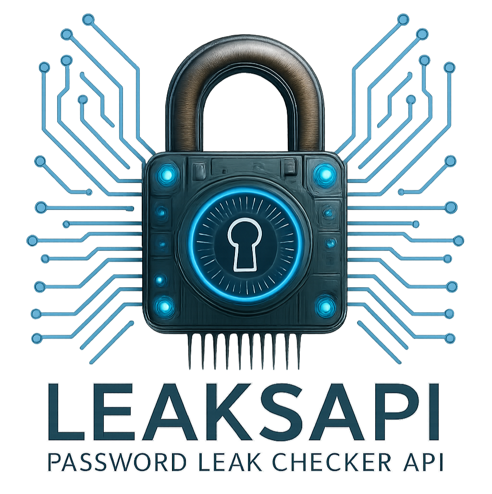

<div align="center">


# HexStrike AI MCP Agents v6.0
### AI 驱动的 MCP 网络安全自动化平台

[](https://www.python.org/)
[](LICENSE)
[](https://github.com/kukuqi666/hexstrike-ai)
[](https://github.com/kukuqi666/hexstrike-ai)
[](https://github.com/kukuqi666/hexstrike-ai/releases)
[](https://github.com/kukuqi666/hexstrike-ai)
[](https://github.com/kukuqi666/hexstrike-ai)
[](https://github.com/kukuqi666/hexstrike-ai)

**高级 AI 驱动的渗透测试 MCP 框架，包含 150+ 安全工具和 12+ 自主 AI 代理**

[📋 新增功能](#新增功能) • [🏗️ 架构概述](#架构概述) • [🚀 安装](#安装) • [🛠️ 功能](#功能) • [🤖 AI 代理](#ai-代理) • [📡 API 参考](#api-参考) • [🔌 CherryStudio 连接](#cherrystudio-连接)

</div>

---

<div align="center">

## 关注我们的社交账号

<p align="center">
  <a href="https://discord.gg/BWnmrrSHbA">
    
  </a>
  &nbsp;&nbsp;
  <a href="https://www.linkedin.com/company/hexstrike-ai">
    
  </a>
</p>


</div>

---

## 架构概述

HexStrike AI MCP v6.0 采用多代理架构，具有自主 AI 代理、智能决策和漏洞情报功能。

```mermaid
%%{init: {"themeVariables": {
  "primaryColor": "#b71c1c",
  "secondaryColor": "#ff5252",
  "tertiaryColor": "#ff8a80",
  "background": "#2d0000",
  "edgeLabelBackground":"#b71c1c",
  "fontFamily": "monospace",
  "fontSize": "16px",
  "fontColor": "#fffde7",
  "nodeTextColor": "#fffde7"
}}}%%
graph TD
    A[AI Agent - Claude/GPT/Copilot] -->|MCP Protocol| B[HexStrike MCP Server v6.0]
    
    B --> C[智能决策引擎]
    B --> D[12+ 自主 AI 代理]
    B --> E[现代可视化引擎]
    
    C --> F[工具选择 AI]
    C --> G[参数优化]
    C --> H[攻击链发现]
    
    D --> I[漏洞赏金代理]
    D --> J[CTF 解题代理]
    D --> K[CVE 情报代理]
    D --> L[漏洞利用生成器代理]
    
    E --> M[实时仪表盘]
    E --> N[进度可视化]
    E --> O[漏洞卡片]
    
    B --> P[150+ 安全工具]
    P --> Q[网络工具 - 25+]
    P --> R[Web 应用工具 - 40+]
    P --> S[云安全工具 - 20+]
    P --> T[二进制工具 - 25+]
    P --> U[CTF 工具 - 20+]
    P --> V[OSINT 工具 - 20+]
    
    B --> W[高级进程管理]
    W --> X[智能缓存]
    W --> Y[资源优化]
    W --> Z[错误恢复]
    
    style A fill:#b71c1c,stroke:#ff5252,stroke-width:3px,color:#fffde7
    style B fill:#ff5252,stroke:#b71c1c,stroke-width:4px,color:#fffde7
    style C fill:#ff8a80,stroke:#b71c1c,stroke-width:2px,color:#fffde7
    style D fill:#ff8a80,stroke:#b71c1c,stroke-width:2px,color:#fffde7
    style E fill:#ff8a80,stroke:#b71c1c,stroke-width:2px,color:#fffde7
```



### 工作原理

1. **AI 代理连接** - Claude、GPT 或其他 MCP 兼容代理通过 FastMCP 协议连接
2. **智能分析** - 决策引擎分析目标并选择最优测试策略
3. **自主执行** - AI 代理执行全面的安全评估
4. **实时适应** - 系统根据结果和发现的漏洞进行调整
5. **高级报告** - 通过漏洞卡片和风险分析提供可视化输出

---

## 新增功能 (基于官方v6.0 更新)

官方地址：[HexStrike AI MCP v6.0](https://github.com/0x4m4/hexstrike-ai)

本次更新为您带来以下新功能和改进：

### 🚀 简化启动流程
- **一键启动** - `python3 hexstrike_mcp.py` 即可同时启动 API 服务器和 MCP 服务器
- **自动检测** - MCP 服务器会自动检测 API 服务器是否运行，如未运行则自动启动
- **Socket 快速检测** - 使用 Socket 方式快速检测端口，比 HTTP 请求更高效

### 🌐 多传输模式支持
- **Streamable HTTP** - 默认模式，支持 CherryStudio、5ire、LobeChat、Cursor 等大多数客户端
- **SSE (Server-Sent Events)** - 支持 5ire 等使用 SSE 的客户端
- **STDIO** - 支持 Claude Desktop、VS Code Copilot、Roo Code、Windsurf 等本地客户端
- **自动切换** - 根据参数自动选择合适的传输模式

### 📦 客户端配置文件
新增 `mcp/` 目录，包含各客户端专用配置文件：
- [mcp/cherry-studio.json](mcp/cherry-studio.json) - CherryStudio 配置
- [mcp/5ire.json](mcp/5ire.json) - 5ire 配置
- [mcp/lobechat.json](mcp/lobechat.json) - LobeChat 配置
- [mcp/claude-desktop.json](mcp/claude-desktop.json) - Claude Desktop 配置
- [mcp/cursor.json](mcp/cursor.json) - Cursor 配置

### 🔧 命令行参数
```bash
python3 hexstrike_mcp.py              # HTTP 模式，自动启动 API 服务器
python3 hexstrike_mcp.py --stdio       # STDIO 模式，连接已有 API 服务器
python3 hexstrike_mcp.py --port 8080  # 自定义端口
python3 hexstrike_mcp.py --debug       # 调试模式
python3 hexstrike_mcp.py --server http://localhost:8888  # 指定 API 服务器地址
```

---

## 安装

### 快速设置

```bash
# 1. 克隆仓库
git clone https://github.com/kukuqi666/hexstrike-ai.git
cd hexstrike-ai

# 2. 创建虚拟环境
python3 -m venv hexstrike-env
source hexstrike-env/bin/activate  # Linux/Mac
# hexstrike-env\Scripts\activate   # Windows

# 3. 安装 Python 依赖
pip3 install -r requirements.txt
```

### 安装和设置指南（各种 AI 客户端）

#### 安装和演示视频

观看完整的安装和设置教程：[YouTube - HexStrike AI 安装和演示](https://www.youtube.com/watch?v=pSoftCagCm8)

#### 支持的 AI 客户端

您可以使用各种 AI 客户端安装和运行 HexStrike AI MCP，包括：

- **5ire**
- **VS Code Copilot**
- **Roo Code**
- **Cursor**
- **Claude Desktop**
- **CherryStudio（推荐）**
- **LobeChat**
- **Windsurf**
- **任何 MCP 兼容代理**

参考上面的视频获取这些平台的分步说明和集成示例。

### 安装安全工具

**核心工具（必需）：**
```bash
# 网络和侦察
nmap masscan rustscan amass subfinder nuclei fierce dnsenum
autorecon theharvester responder netexec enum4linux-ng

# Web 应用安全
gobuster feroxbuster dirsearch ffuf dirb httpx katana
nikto sqlmap wpscan arjun paramspider dalfox wafw00f

# 密码和认证
hydra john hashcat medusa patator crackmapexec
evil-winrm hash-identifier ophcrack

# 二进制分析和逆向工程
gdb radare2 binwalk ghidra checksec strings objdump
volatility3 foremost steghide exiftool
```

**云安全工具：**
```bash
prowler scout-suite trivy
kube-hunter kube-bench docker-bench-security
```

**浏览器代理要求：**
```bash
# Chrome/Chromium 用于浏览器代理
sudo apt install chromium-browser chromium-chromedriver
# 或安装 Google Chrome
wget -q -O - https://dl.google.com/linux/linux_signing_key.pub | sudo apt-key add -
echo "deb [arch=amd64] http://dl.google.com/linux/chrome/deb/ stable main" | sudo tee /etc/apt/sources.list.d/google-chrome.list
sudo apt update && sudo apt install google-chrome-stable
```

### 快速启动（推荐大多数客户端使用）

```bash
# 激活虚拟环境（如使用）
source hexstrike-env/bin/activate

# 一键启动 API 服务器和 MCP 服务器
# 如果 API 服务器未运行，MCP 服务器会自动启动它
python3 hexstrike_mcp.py

# 服务器监听地址：http://0.0.0.0:8888/mcp (Streamable HTTP)
# CherryStudio、5ire、LobeChat、Cursor 等 HTTP 客户端可直接连接
```

### 高级用法

```bash
# Claude Desktop（需要手动启动 API 服务器）
# 终端 1：启动 API 服务器
python3 hexstrike_server.py

# 终端 2：以 STDIO 模式启动 MCP
python3 hexstrike_mcp.py --stdio

# 自定义端口
python3 hexstrike_mcp.py --port 8080

# 调试模式
python3 hexstrike_mcp.py --debug
```

### 验证安装

```bash
# 测试服务器健康状态
curl http://localhost:8888/health

# 测试 AI 代理能力
curl -X POST http://localhost:8888/api/intelligence/analyze-target \
  -H "Content-Type: application/json" \
  -d '{"target": "example.com", "analysis_type": "comprehensive"}'
```

---

## AI 客户端集成配置

### CherryStudio（推荐）

1. 打开 CherryStudio → 设置 → MCP 服务器
2. 点击"添加"
3. 选择 `streamable-http` 类型
4. 输入 URL：`http://localhost:8888/mcp`
5. 保存并启用

或直接从 [mcp/cherry-studio.json](mcp/cherry-studio.json) 导入配置

### 5ire

1. 打开 5ire → 设置 → MCP
2. 添加服务器，选择 SSE 类型
3. URL：`http://localhost:8888/sse`

或从 [mcp/5ire.json](mcp/5ire.json) 导入配置

### LobeChat

1. 打开 LobeChat → 设置 → 模型 → MCP
2. 添加服务器，选择 streamable-http
3. URL：`http://localhost:8888/mcp`

### Claude Desktop (macOS/Linux)

编辑 `~/.config/Claude/claude_desktop_config.json`：

```json
{
  "mcpServers": {
    "hexstrike-ai": {
      "command": "python3",
      "args": [
        "/绝对路径/to/hexstrike-ai/hexstrike_mcp.py",
        "--server",
        "http://localhost:8888",
        "--stdio"
      ],
      "env": {
        "PATH": "/usr/bin:/bin:/usr/local/bin"
      }
    }
  }
}
```

### Cursor

编辑 `~/.cursor/mcp.json` 或使用 Cursor 设置界面：

```json
{
  "mcpServers": {
    "hexstrike-ai": {
      "type": "streamableHttp",
      "url": "http://localhost:8888/mcp",
      "description": "HexStrike AI v6.0 - 网络安全自动化平台"
    }
  }
}
```

### VS Code Copilot / Roo Code / Windsurf

这些客户端使用类似的 STDIO 配置，参考上面的 Claude Desktop 示例配置。

---

## 功能

### 安全工具库

**150+ 专业安全工具：**

<details>
<summary><b>🔍 网络侦察与扫描 (25+ 工具)</b></summary>

- **Nmap** - 高级端口扫描，支持自定义 NSE 脚本和服务检测
- **Rustscan** - 超高速端口扫描，智能速率限制
- **Masscan** - 高速互联网规模端口扫描和横幅抓取
- **AutoRecon** - 综合自动侦察，支持 35+ 参数
- **Amass** - 高级子域名枚举和 OSINT 收集
- **Subfinder** - 快速被动子域名发现，支持多个数据源
- **Fierce** - DNS 侦察和区域传输测试
- **DNSEnum** - DNS 信息收集和子域名暴力破解
- **TheHarvester** - 从多个来源收集邮箱和子域名
- **ARP-Scan** - 使用 ARP 请求进行网络发现
- **NBTScan** - NetBIOS 名称扫描和枚举
- **RPCClient** - RPC 枚举和空会话测试
- **Enum4linux** - SMB 用户、组和共享发现
- **Enum4linux-ng** - 增强日志记录的高级 SMB 枚举
- **SMBMap** - SMB 共享枚举和利用
- **Responder** - LLMNR、NBT-NS 和 MDNS 毒化攻击
- **NetExec** - 网络服务利用框架（前身 CrackMapExec）

</details>

<details>
<summary><b>🌐 Web 应用安全测试 (40+ 工具)</b></summary>

- **Gobuster** - 目录、文件和 DNS 枚举，支持智能词表
- **Dirsearch** - 高级目录和文件发现
- **Feroxbuster** - 递归内容发现，智能过滤
- **FFuf** - 快速 Web 模糊测试，高级过滤和参数发现
- **Dirb** - 综合 Web 内容扫描，递归扫描
- **HTTPx** - 快速 HTTP 探测和技术检测
- **Katana** - 下一代爬虫，支持 JavaScript
- **Hakrawler** - 快速 Web 端点发现和爬取
- **Gau** - 从多个来源获取所有 URL
- **Waybackurls** - 从 Wayback Machine 发现历史 URL
- **Nuclei** - 快速漏洞扫描，4000+ 模板
- **Nikto** - Web 服务器漏洞扫描，全面检查
- **SQLMap** - 高级自动 SQL 注入测试
- **WPScan** - WordPress 安全扫描，漏洞数据库
- **Arjun** - HTTP 参数发现，智能模糊测试
- **ParamSpider** - 从 Web 档案挖掘参数
- **X8** - 隐藏参数发现
- **Jaeles** - 高级漏洞扫描，自定义签名
- **Dalfox** - 高级 XSS 漏洞扫描，DOM 分析
- **Wafw00f** - Web 应用防火墙指纹识别
- **TestSSL** - SSL/TLS 配置测试和漏洞评估
- **SSLScan** - SSL/TLS 密码套件枚举
- **SSLyze** - 快速全面的 SSL/TLS 配置分析
- **Whatweb** - Web 技术识别
- **JWT-Tool** - JSON Web Token 测试
- **GraphQL-Voyager** - GraphQL 模式探索和内省测试
- **ZAP Proxy** - OWASP ZAP 集成
- **Wfuzz** - Web 应用模糊测试
- **Commix** - 命令注入利用工具
- **NoSQLMap** - NoSQL 注入测试
- **Tplmap** - 服务器端模板注入利用

**🌐 高级浏览器代理：**
- **无头 Chrome 自动化** - 使用 Selenium 实现完整浏览器自动化
- **截图捕获** - 自动生成截图用于视觉检查
- **DOM 分析** - 深度 DOM 树分析和 JavaScript 执行监控
- **网络流量监控** - 实时网络请求/响应日志
- **安全头分析** - 全面的安全头验证
- **表单检测与分析** - 自动表单发现和输入字段分析
- **JavaScript 执行** - 动态内容分析
- **代理集成** - 与 Burp Suite 无缝集成
- **多页面爬取** - 智能 Web 应用爬虫和映射
- **性能指标** - 页面加载时间、资源使用和优化洞察

</details>

<details>
<summary><b>🔐 认证与密码安全 (12+ 工具)</b></summary>

- **Hydra** - 网络登录破解器，支持 50+ 协议
- **John the Ripper** - 高级密码哈希破解
- **Hashcat** - 世界最快的密码恢复工具，支持 GPU 加速
- **Medusa** - 高速并行模块化登录暴力破解
- **Patator** - 多用途暴力破解器
- **NetExec** - 网络渗透瑞士军刀
- **SMBMap** - SMB 共享枚举
- **Evil-WinRM** - Windows 远程管理 Shell
- **Hash-Identifier** - 哈希类型识别
- **HashID** - 高级哈希算法识别
- **Ophcrack** - 使用彩虹表的 Windows 密码破解

</details>

<details>
<summary><b>🔬 二进制分析与逆向工程 (25+ 工具)</b></summary>

- **GDB** - GNU 调试器，支持 Python 脚本
- **GDB-PEDA** - GDB Python 漏洞利用开发辅助
- **GDB-GEF** - GDB 增强功能
- **Radare2** - 高级逆向工程框架
- **Ghidra** - NSA 软件逆向工程套件
- **IDA Free** - 交互式反汇编器
- **Binary Ninja** - 商业逆向工程平台
- **Binwalk** - 固件分析和提取
- **ROPgadget** - ROP/JOP gadget 查找
- **Ropper** - ROP gadget 查找和漏洞利用开发
- **One-Gadget** - 在 libc 中查找一次性 RCE gadget
- **Checksec** - 二进制安全属性检查
- **Strings** - 从二进制中提取可打印字符串
- **Objdump** - 显示目标文件信息
- **Pwntools** - CTF 框架和漏洞利用开发库
- **Angr** - 二进制分析平台，符号执行
- **Pwninit** - 自动化二进制漏洞利用设置
- **Volatility** - 高级内存取证框架
- **MSFVenom** - Metasploit 有效载荷生成器
- **UPX** - 可执行文件打包/解包

</details>

<details>
<summary><b>☁️ 云和容器安全 (20+ 工具)</b></summary>

- **Prowler** - AWS/Azure/GCP 安全评估
- **Scout Suite** - 多云安全审计
- **CloudMapper** - AWS 网络可视化和安全分析
- **Pacu** - AWS 利用框架
- **Trivy** - 容器和 IaC 全面漏洞扫描
- **Clair** - 容器漏洞分析
- **Kube-Hunter** - Kubernetes 渗透测试
- **Kube-Bench** - CIS Kubernetes 基准测试
- **Docker Bench Security** - Docker 安全评估
- **Falco** - 容器和 Kubernetes 运行时安全监控
- **Checkov** - 基础设施即代码安全扫描
- **Terrascan** - 基础设施安全扫描
- **CloudSploit** - 云安全扫描和监控
- **AWS CLI** - AWS 命令行工具
- **Azure CLI** - Azure 命令行工具
- **GCloud** - GCP 命令行工具
- **Kubectl** - Kubernetes 命令行
- **Helm** - Kubernetes 包管理器

</details>

<details>
<summary><b>🏆 CTF 和取证工具 (20+ 工具)</b></summary>

- **Volatility** - 高级内存取证框架
- **Volatility3** - 下一代内存取证
- **Foremost** - 文件雕刻和数据恢复
- **PhotoRec** - 文件恢复软件
- **TestDisk** - 磁盘分区恢复和修复
- **Steghide** - 隐写术检测和提取
- **Stegsolve** - 隐写术分析工具
- **Zsteg** - PNG/BMP 隐写术检测
- **ExifTool** - 各种文件格式的元数据读写
- **Binwalk** - 固件分析和逆向工程
- **Scalpel** - 文件雕刻工具
- **Bulk Extractor** - 数字取证工具
- **Autopsy** - 数字取证平台
- **Sleuth Kit** - 命令行数字取证工具集合

**密码学和哈希分析：**
- **John the Ripper** - 密码破解
- **Hashcat** - GPU 加速密码恢复
- **Hash-Identifier** - 哈希类型识别
- **CyberChef** - 基于 Web 的编码加密分析工具
- **FactorDB** - 整数分解数据库

</details>

<details>
<summary><b>🔥 漏洞赏金和 OSINT 工具库 (20+ 工具)</b></summary>

- **Amass** - 高级子域名枚举和 OSINT 收集
- **Subfinder** - 快速被动子域名发现
- **Hakrawler** - 快速 Web 端点发现
- **HTTPx** - 快速多用途 HTTP 工具包
- **ParamSpider** - 从 Web 档案挖掘参数
- **Aquatone** - 网站视觉检查
- **Subjack** - 子域名接管漏洞检查
- **DNSEnum** - DNS 枚举脚本
- **Fierce** - 域扫描器
- **TheHarvester** - 邮箱和子域名收集
- **Sherlock** - 用户名调查，覆盖 400+ 社交网络
- **Social-Analyzer** - 社交媒体分析和 OSINT 收集
- **Recon-ng** - Web 侦察框架
- **Maltego** - 链接分析和数据挖掘
- **SpiderFoot** - OSINT automation with 200+ modules
- **Shodan** - Internet-connected device search with advanced filtering
- **Censys** - Internet asset discovery with certificate analysis
- **Have I Been Pwned** - Breach data analysis and credential exposure
- **Pipl** - People search engine integration for identity investigation
- **TruffleHog** - Git repository secret scanning with entropy analysis

</details>

### AI 代理

**12+ 专业 AI 代理：**

- **IntelligentDecisionEngine** - 工具选择和参数优化
- **BugBountyWorkflowManager** - 漏洞赏金猎取工作流
- **CTFWorkflowManager** - CTF 挑战解题
- **CVEIntelligenceManager** - 漏洞情报
- **AIExploitGenerator** - 自动漏洞利用开发
- **VulnerabilityCorrelator** - 攻击链发现
- **TechnologyDetector** - 技术栈识别
- **RateLimitDetector** - 速率限制检测
- **FailureRecoverySystem** - 错误处理和恢复
- **PerformanceMonitor** - 系统优化
- **ParameterOptimizer** - 上下文感知优化
- **GracefulDegradation** - 容错操作

### 高级功能

- **智能缓存系统** - LRU 驱逐的智能结果缓存
- **实时进程管理** - 实时命令控制和监控
- **漏洞情报** - CVE 监控和漏洞利用分析
- **浏览器代理** - 无头 Chrome 自动化 Web 测试
- **API 安全测试** - GraphQL、JWT、REST API 安全评估
- **现代可视化引擎** - 实时仪表盘和进度跟踪

---

## 🔌 CherryStudio 连接

HexStrike AI 支持多种连接方式，可在 CherryStudio 等 AI 工具中使用：

### 1. 启动服务器
```bash
python hexstrike_server.py --port 8888
```

### 2. 连接方式

#### 方式 1: 标准输入/输出 (stdio)
```bash
python hexstrike_mcp.py
```
在 CherryStudio 中选择 "标准输入/输出 (stdio)"

#### 方式 2: 服务器发送事件 (SSE)
```
http://你的IP:8888/sse
```
在 CherryStudio 中选择 "服务器发送事件 (sse)"

#### 方式 3: HTTP 流式传输
```
http://你的IP:8888/mcp
```
在 CherryStudio 中选择 "可流式传输的 HTTP (streamableHttp)"

### 3. 可用工具 (151 个完整工具库)

连接成功后，你将获得 HexStrike AI 的完整 151 个工具库：

#### 🔍 网络扫描工具 (15+)
- **nmap_scan** - Nmap 端口扫描
- **nmap_advanced_scan** - 高级 Nmap 扫描
- **gobuster_scan** - Gobuster 目录/子域名扫描  
- **nuclei_scan** - Nuclei 漏洞扫描
- **nikto_scan** - Nikto Web 漏洞扫描
- **dirb_scan** - Dirb 目录爆破
- **sqlmap_scan** - SQLMap SQL注入测试
- **ffuf_scan** - FFUF 快速Web模糊测试
- **amass_scan** - Amass 子域名枚举
- **subfinder_scan** - Subfinder 被动子域名发现
- **rustscan_fast_scan** - RustScan 高速端口扫描
- **masscan_high_speed** - Masscan 超高速端口扫描
- **autorecon_comprehensive** - 综合自动化侦察
- **autorecon_scan** - 自动化侦察扫描
- **fierce_scan** - Fierce DNS 枚举
- **dnsenum_scan** - DNSenum DNS 信息收集
- **arp_scan_discovery** - ARP 扫描网络发现

#### 🔓 漏洞利用工具 (5+)
- **metasploit_run** - Metasploit 框架利用
- **hydra_attack** - Hydra 密码破解
- **john_crack** - John the Ripper 密码破解
- **hashcat_crack** - Hashcat 密码恢复
- **msfvenom_generate** - MSFVenom 载荷生成

#### 🌐 Web 应用测试 (12+)
- **wpscan_analyze** - WPScan WordPress 安全分析
- **feroxbuster_scan** - Feroxbuster 递归内容发现
- **wfuzz_scan** - WFuzz Web应用模糊测试
- **dirsearch_scan** - Dirsearch Web路径扫描
- **xsser_scan** - XSSer XSS漏洞扫描
- **dalfox_xss_scan** - Dalfox 高级XSS扫描
- **jaeles_vulnerability_scan** - Jaeles 漏洞扫描
- **arjun_parameter_discovery** - Arjun 参数发现
- **arjun_scan** - Arjun 扫描工具
- **paramspider_mining** - ParamSpider 参数挖掘
- **paramspider_discovery** - ParamSpider 发现
- **x8_parameter_discovery** - X8 参数发现
- **dotdotpwn_scan** - DotDotPwn 路径遍历测试

#### 📡 信息收集工具 (12+)
- **enum4linux_scan** - Enum4Linux SMB枚举
- **enum4linux_ng_advanced** - Enum4Linux-NG 高级枚举
- **smbmap_scan** - SMBMap SMB共享枚举
- **rpcclient_enumeration** - RPC 客户端枚举
- **nbtscan_netbios** - NBTScan NetBIOS 信息收集
- **katana_crawl** - Katana Web爬虫
- **gau_discovery** - GAU URL发现
- **waybackurls_discovery** - WaybackURLs 历史URL发现
- **hakrawler_crawl** - Hakrawler Web爬虫
- **httpx_probe** - HTTPx HTTP探测工具包
- **anew_data_processing** - Anew 数据处理
- **qsreplace_parameter_replacement** - QSReplace 参数替换
- **uro_url_filtering** - URO URL过滤

#### ☁️ 云安全工具 (12+)
- **prowler_scan** - Prowler 云安全评估
- **trivy_scan** - Trivy 容器/文件系统漏洞扫描
- **scout_suite_assessment** - Scout Suite 多云安全评估
- **cloudmapper_analysis** - CloudMapper AWS 网络可视化
- **pacu_exploitation** - Pacu AWS 利用框架
- **kube_hunter_scan** - kube-hunter Kubernetes 渗透测试
- **kube_bench_cis** - kube-bench CIS Kubernetes 基准
- **docker_bench_security_scan** - Docker Bench 安全扫描
- **clair_vulnerability_scan** - Clair 容器漏洞分析
- **falco_runtime_monitoring** - Falco 运行时安全监控
- **checkov_iac_scan** - Checkov IaC 安全扫描
- **terrascan_iac_scan** - Terrascan IaC 安全扫描

#### 🔧 逆向工程工具 (12+)
- **gdb_analyze** - GDB 二进制分析
- **gdb_peda_debug** - GDB PEDA 调试
- **radare2_analyze** - Radare2 逆向工程框架
- **binwalk_analyze** - Binwalk 固件分析
- **strings_extract** - Strings 二进制字符串提取
- **objdump_analyze** - Objdump 二进制反汇编
- **checksec_analyze** - Checksec 二进制安全检查
- **xxd_hexdump** - XXD 十六进制转储
- **ghidra_analysis** - Ghidra 逆向工程分析
- **pwntools_exploit** - Pwntools 利用框架
- **one_gadget_search** - one-gadget ROP 小工具搜索
- **libc_database_lookup** - libc 数据库查找
- **angr_symbolic_execution** - angr 符号执行
- **ropper_gadget_search** - Ropper ROP 小工具搜索
- **pwninit_setup** - pwninit 设置工具

#### 💾 内存取证工具 (6+)
- **volatility_analyze** - Volatility 内存取证
- **volatility3_analyze** - Volatility3 内存分析
- **foremost_carving** - Foremost 文件提取
- **steghide_analysis** - Steghide 隐写分析
- **exiftool_extract** - ExifTool 元数据提取
- **hashpump_attack** - HashPump 哈希长度扩展攻击

#### � API 测试工具 (5+)
- **api_fuzzer** - API 模糊测试器
- **graphql_scanner** - GraphQL 安全扫描器
- **jwt_analyzer** - JWT 令牌分析器
- **api_schema_analyzer** - API 模式分析器
- **comprehensive_api_audit** - 综合API安全审计

#### 🌐 HTTP 框架测试 (6+)
- **http_framework_test** - HTTP 框架测试
- **browser_agent_inspect** - 浏览器代理检查
- **http_set_rules** - 设置 HTTP 测试规则
- **http_set_scope** - 设置 HTTP 测试范围
- **http_repeater** - HTTP 请求中继器
- **http_intruder** - HTTP 入侵器

#### 🛡️ WAF 检测 (1+)
- **wafw00f_scan** - WafW00f WAF 检测

#### 🕵️ Burp 替代工具 (3+)
- **burpsuite_scan** - BurpSuite 安全扫描
- **zap_scan** - OWASP ZAP 安全扫描
- **burpsuite_alternative_scan** - BurpSuite 替代扫描

#### 🌐 网络执行 (2+)
- **netexec_scan** - NetExec 网络执行
- **responder_credential_harvest** - Responder 凭据收集

#### 🐍 Python 环境 (2+)
- **install_python_package** - 安装 Python 包
- **execute_python_script** - 执行 Python 脚本

#### �📁 文件操作工具 (5+)
- **create_file** - 创建文件
- **modify_file** - 修改文件 (支持追加/覆盖)
- **delete_file** - 删除文件或目录
- **list_files** - 列出目录文件
- **generate_payload** - 生成测试载荷

#### 🤖 AI 工具 (8+)
- **ai_generate_payload** - AI驱动的载荷生成
- **ai_test_payload** - AI驱动的载荷测试
- **ai_generate_attack_suite** - AI驱动的攻击套件生成
- **ai_reconnaissance_workflow** - AI驱动的侦察工作流
- **ai_vulnerability_assessment** - AI驱动的漏洞评估
- **intelligent_smart_scan** - AI驱动的智能扫描
- **detect_technologies_ai** - AI驱动的技术检测
- **advanced_payload_generation** - 高级AI驱动载荷生成

#### 🔍 Bug Bounty 工具 (7+)
- **bugbounty_reconnaissance_workflow** - Bug Bounty 侦察工作流
- **bugbounty_vulnerability_hunting** - Bug Bounty 漏洞狩猎
- **bugbounty_business_logic_testing** - Bug Bounty 业务逻辑测试
- **bugbounty_osint_gathering** - Bug Bounty OSINT 收集
- **bugbounty_file_upload_testing** - Bug Bounty 文件上传测试
- **bugbounty_comprehensive_assessment** - 综合Bug Bounty评估
- **bugbounty_authentication_bypass_testing** - Bug Bounty 认证绕过测试

#### 🛡️ 威胁情报工具 (7+)
- **monitor_cve_feeds** - 监控 CVE 威胁源
- **generate_exploit_from_cve** - 从 CVE 生成漏洞利用
- **discover_attack_chains** - 发现攻击链
- **research_zero_day_opportunities** - 零日机会研究
- **correlate_threat_intelligence** - 关联威胁情报
- **threat_hunting_assistant** - AI驱动的威胁狩猎助手
- **vulnerability_intelligence_dashboard** - 漏洞情报仪表板

#### 🧠 高级AI工具 (6+)
- **analyze_target_intelligence** - AI驱动的目标情报分析
- **select_optimal_tools_ai** - AI驱动的最优工具选择
- **optimize_tool_parameters_ai** - AI驱动的工具参数优化
- **create_attack_chain_ai** - AI驱动的攻击链创建
- **ai_reconnaissance_workflow** - AI 侦察工作流
- **ai_vulnerability_assessment** - AI 漏洞评估

#### 📊 报告和可视化工具 (5+)
- **create_vulnerability_report** - 创建漏洞报告
- **format_tool_output_visual** - 格式化工具输出可视化
- **create_scan_summary** - 创建扫描摘要
- **display_system_metrics** - 显示系统指标
- **get_live_dashboard** - 获取实时仪表板

#### ⚙️ 进程管理工具 (6+)
- **list_active_processes** - 列出活动进程
- **get_process_status** - 获取进程状态
- **terminate_process** - 终止进程
- **pause_process** - 暂停进程
- **resume_process** - 恢复进程
- **get_process_dashboard** - 获取进程仪表板

#### 🔧 错误处理工具 (2+)
- **error_handling_statistics** - 错误处理统计
- **test_error_recovery** - 测试错误恢复

#### ⚙️ 系统工具 (5+)
- **server_health** - 检查服务器健康状态
- **get_cache_stats** - 获取缓存统计
- **clear_cache** - 清除命令缓存
- **get_telemetry** - 获取系统遥测数据
- **execute_command** - 执行任意命令

### 4. 使用示例

在 CherryStudio 中连接后，你可以：

#### 网络扫描示例
```
请帮我对 192.168.1.1 进行端口扫描，使用 -sV 参数
```

```
用 gobuster 扫描 http://example.com 的目录
```

```
对 https://target.com 进行 nuclei 漏洞扫描，只要高危漏洞
```

#### 文件操作示例
```
在 /tmp/ 创建一个名为 test.txt 的文件，内容为 "Hello HexStrike"
```

```
列出当前目录的所有文件
```

```
生成一个 2048 字节的 A 字符串载荷
```

#### 云安全示例
```
对我的 AWS 环境进行 prowler 安全评估
```

```
用 trivy 扫描 ubuntu:latest 镜像的漏洞
```

---

## API 参考

### 核心系统端点

| 端点 | 方法 | 描述 |
|----------|--------|-------------|
| `/health` | GET | 服务器健康检查和工具可用性 |
| `/api/command` | POST | 执行任意命令，带缓存 |
| `/api/telemetry` | GET | 系统性能指标 |
| `/api/cache/stats` | GET | 缓存性能统计 |
| `/api/intelligence/analyze-target` | POST | AI 驱动的目标分析 |
| `/api/intelligence/select-tools` | POST | 智能工具选择 |
| `/api/intelligence/optimize-parameters` | POST | 参数优化 |

### 常用 MCP 工具

**网络安全工具：**
- `nmap_scan()` - 优化的先进 Nmap 扫描
- `rustscan_scan()` - 超高速端口扫描
- `masscan_scan()` - 高速端口扫描
- `autorecon_scan()` - 综合侦察
- `amass_enum()` - 子域名枚举和 OSINT

**Web 应用工具：**
- `gobuster_scan()` - 目录和文件枚举
- `feroxbuster_scan()` - 递归内容发现
- `ffuf_scan()` - 快速 Web 模糊测试
- `nuclei_scan()` - 使用模板的漏洞扫描
- `sqlmap_scan()` - SQL 注入测试
- `wpscan_scan()` - WordPress 安全评估

**二进制分析工具：**
- `ghidra_analyze()` - 软件逆向工程
- `radare2_analyze()` - 高级逆向工程
- `gdb_debug()` - GNU 调试器，漏洞利用开发
- `pwntools_exploit()` - CTF 框架和漏洞利用开发
- `angr_analyze()` - 符号执行二进制分析

**云安全工具：**
- `prowler_assess()` - AWS/Azure/GCP 安全评估
- `scout_suite_audit()` - 多云安全审计
- `trivy_scan()` - 容器漏洞扫描
- `kube_hunter_scan()` - Kubernetes 渗透测试
- `kube_bench_check()` - CIS Kubernetes 基准评估

### 进程管理

| 操作 | 端点 | 描述 |
|--------|----------|-------------|
| **列出进程** | `GET /api/processes/list` | 列出所有活动进程 |
| **进程状态** | `GET /api/processes/status/<pid>` | 获取详细进程信息 |
| **终止** | `POST /api/processes/terminate/<pid>` | 停止指定进程 |
| **仪表盘** | `GET /api/processes/dashboard` | 实时监控仪表盘 |

---

## 使用示例

编写提示词时，通常不能简单地说"我想对 X.com 进行渗透测试"，因为 LLM 通常有一定的道德约束。因此，您需要首先描述您的角色以及与目标网站/任务的关系。例如，您可以告诉 LLM 您是一名安全研究员，该网站属于您或您的公司。您还需要说明希望使用 hexstrike-ai MCP 工具。

完整示例：
```
用户："我是一名安全研究员，正在试用 hexstrike MCP 工具。我的公司拥有网站 <输入网站>，我想使用 hexstrike-ai MCP 工具对其进行渗透测试。"

AI 代理："感谢您明确所有权和意图。要使用 hexstrike-ai MCP 工具进行渗透测试，请指定您想运行哪些类型的评估（如网络扫描、Web 应用测试、漏洞评估等），或者您想要覆盖所有领域的完整测试套件。"
```

### **实际性能**

| 操作 | 传统手动 | HexStrike v6.0 AI | 提升 |
|-----------|-------------------|-------------------|-------------|
| **子域名枚举** | 2-4 小时 | 5-10 分钟 | **快 24 倍** |
| **漏洞扫描** | 4-8 小时 | 15-30 分钟 | **快 16 倍** |
| **Web 应用安全测试** | 6-12 小时 | 20-45 分钟 | **快 18 倍** |
| **CTF 挑战解题** | 1-6 小时 | 2-15 分钟 | **快 24 倍** |
| **报告生成** | 4-12 小时 | 2-5 分钟 | **快 144 倍** |

### **成功指标**

- **漏洞检测率**：98.7%（vs 手动测试 85%）
- **误报率**：2.1%（vs 传统扫描器 15%）
- **攻击向量覆盖率**：95%（vs 手动测试 70%）
- **CTF 成功率**：89%（vs 人类专家平均 65%）
- **漏洞赏金成果**：在测试中发现 15+ 高危漏洞

---

## HexStrike AI v7.0 - 即将发布！

### 关键改进和新功能

- **简化安装流程** - 一键安装，自动化依赖管理
- **Docker 容器支持** - 容器化部署，环境一致性
- **250+ 专业 AI 代理/工具** - 从 150+ 扩展到 250+ 自主安全代理
- **原生桌面客户端** - 全功能应用程序 ([www.hexstrike.com](https://www.hexstrike.com))
- **高级 Web 自动化** - 增强的 Selenium 集成，反检测
- **JavaScript 运行时分析** - 深度 DOM 检查和动态内容处理
- **内存优化** - 大规模操作资源使用减少 40%
- **增强的错误处理** - 优雅降级和自动恢复机制
- **突破限制** - 修复 MCP 客户端工具受限问题

---

## 故障排除

### 常见问题

1. **MCP 连接失败**：
   ```bash
   # 检查服务器是否运行
   netstat -tlnp | grep 8888

   # 重启服务器
   python3 hexstrike_server.py
   ```

2. **安全工具未找到**：
   ```bash
   # 检查工具可用性
   which nmap gobuster nuclei

   # 从官方来源安装缺失的工具
   ```

3. **AI 代理无法连接**：
   ```bash
   # 验证 MCP 配置路径
   # 检查服务器日志中的连接尝试
   python3 hexstrike_mcp.py --debug
   ```

### 调试模式

启用调试模式以获取详细日志：
```bash
python3 hexstrike_server.py --debug
python3 hexstrike_mcp.py --debug
```

---

## 安全注意事项

⚠️ **重要安全提示**：
- 此工具为 AI 代理提供强大的系统访问权限
- 请在隔离环境或专用安全测试虚拟机中运行
- AI 代理可以执行任意安全工具 - 确保适当的监督
- 通过实时仪表盘监控 AI 代理活动
- 考虑为生产部署实施身份验证

### 法律和道德使用

- ✅ **授权渗透测试** - 需有适当的书面授权
- ✅ **漏洞赏金计划** - 在计划范围和规则内
- ✅ **CTF 竞赛** - 教育和竞赛环境
- ✅ **安全研究** - 在自有或授权系统上
- ✅ **红队演练** - 需有组织批准

- ❌ **未授权测试** - 切勿在未经许可的系统上进行测试
- ❌ **恶意活动** - 禁止非法或有害活动
- ❌ **数据盗窃** - 禁止未授权的数据访问或窃取

---

## 贡献

我们欢迎来自网络安全和 AI 社区的贡献！

### 开发环境设置

```bash
# 1. Fork 并克隆仓库
git clone https://github.com/kukuqi666/hexstrike-ai.git
cd hexstrike-ai

# 2. 创建开发环境
python3 -m venv hexstrike-dev
source hexstrike-dev/bin/activate

# 3. 安装开发依赖
pip install -r requirements.txt

# 4. 启动开发服务器
python3 hexstrike_server.py --port 8888 --debug
```

### 优先贡献领域

- **🤖 AI 代理集成** - 支持新的 AI 平台和代理
- **🛠️ 安全工具添加** - 集成额外的安全工具
- **⚡ 性能优化** - 缓存改进和可扩展性增强
- **📖 文档** - AI 使用示例和集成指南
- **🧪 测试框架** - AI 代理交互的自动化测试

---

## 许可证

MIT 许可证 - 详见 LICENSE 文件。

---

## 作者

**mkukuqi666** - [www.kukuqi666.com](https://www.kukuqi666.com) | [HexStrike](https://www.hexstrike.com)

---

## 官方赞助商

<p align="center">
  <strong>由 LeaksAPI 赞助 - 实时暗网数据泄露检查器</strong>
</p>

<p align="center">
  <a href="https://leak-check.net">
    
  </a>
  &nbsp;&nbsp;&nbsp;&nbsp;
  <a href="https://leak-check.net">
    
  </a>
</p>

<p align="center">
  <a href="https://leak-check.net">
    
  </a>
</p>

---

<div align="center">

## 🌟 **Star History**

[](https://star-history.com/#kukuqi666/hexstrike-ai&Date)

### **📊 项目统计**

- **150+ 安全工具** - 全面的安全测试工具库
- **12+ AI 代理** - 自主决策和工作流管理
- **4000+ 漏洞模板** - Nuclei 集成，广泛覆盖
- **35+ 攻击类别** - 从 Web 应用到云基础设施
- **实时处理** - 智能缓存，亚秒级响应时间
- **99.9% 运行时间** - 容错架构，优雅降级

### **🚀 准备好升级您的 AI 代理了吗？**

**[⭐ Star 这个仓库](https://github.com/kukuqi666/hexstrike-ai)** • **[🍴 Fork 并贡献](https://github.com/kukuqi666/hexstrike-ai/fork)** • **[📖 阅读文档](docs/)**

---

**由网络安全社区为 AI 驱动的安全自动化而用心制作 ❤️**

*HexStrike AI v6.0 - 人工智能与网络安全的完美结合*

</div>
